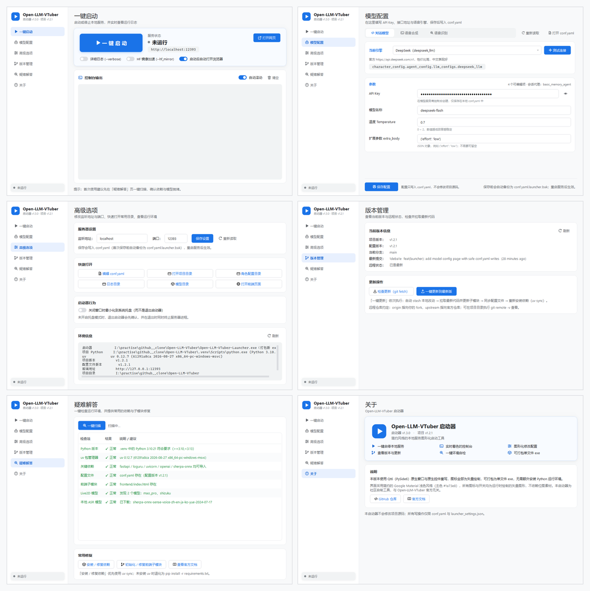

# Open-LLM-VTuber Qt6 启动器

一个用 **Qt6 / PySide6** 重写的原生 Windows 图形化启动器，用来替代仓库根目录里早期的
tkinter 版 `launcher.py`。界面采用简约的 **Google Material 浅色风格**（白色表面、`#1a73e8`
主色、克制的圆角与投影）：左侧导航、卡片式布局，完全使用系统原生窗口与原生控件，
可打包成单文件 exe 分发。

> 本启动器是社区自制工具，与 Open-LLM-VTuber 官方无关。
>
> 旧的 tkinter 版本仍保留在根目录 `launcher.py` 中作为历史参考（`启动器.bat` 已不再调用它）。

## 界面预览



单页截图放在 `docs/launcher/`：`home.png`、`models.png`、`advanced.png`、`version.png`、
`troubleshoot.png`、`about.png`（由打包后的 exe 在 Windows 下实际运行并渲染生成，非设计稿）。

## 功能

| 页面 | 内容 |
| --- | --- |
| 一键启动 | 启停 `run_server.py`、实时彩色控制台、`--verbose` / `--hf_mirror` / 自动打开浏览器开关、自动滚动与清空 |
| 模型配置 | 图形化编辑 `conf.yaml`：切换 LLM / TTS / ASR 引擎，填写 API Key、接口地址与全部参数，测试连接，保存（Ctrl+S） |
| 高级选项 | 修改 `conf.yaml` 的监听地址与端口（自动备份）、6 个快捷打开入口、环境信息面板、托盘行为开关 |
| 版本管理 | 当前分支 / 最新提交 / 远程领先落后状态、`git fetch` 检查更新、一键更新（stash → pull + 子模块 → 同步配置 → `uv sync`） |
| 疑难解答 | 8 项环境一键扫描（Python 版本、uv、关键依赖、配置文件、前端子模块、Live2D 模型、ASR 模型、端口占用）、安装依赖、修复子模块 |
| 关于 | 版本信息、仓库与文档链接 |

### 模型配置页

- **三个分段**：对话模型（12 个 LLM 提供商）、语音合成（20 个 TTS 引擎）、语音识别（7 个 ASR 引擎）；
- 每个提供商都有对应字段：API Key（默认掩码，可点眼睛查看）、接口地址、模型名、温度、
  采样参数、参考音频、VITS 模型路径等；布尔项是开关，枚举项是下拉框，JSON 项（如 DeepSeek 的
  `extra_body`）会做格式校验；
- **测试连接**只做只读探测：接口地址走 TCP + HTTP 探测，本地模型文件检查是否存在，
  API Key 只检查是否非空（不会发起任何付费请求）；
- 界面顶部显示当前引擎对应的 `conf.yaml` 路径，右侧可一键打开 `conf.yaml`；
- 保存时只改动目标行：值没变化就不动文件，写入前自动备份为 `conf.yaml.launcher.bak`，
  并复查写回后的 YAML 是否与预期一致（不一致会自动退化到 ruamel 重写）。

其他特性：

- Google Material 浅色主题：`#f8f9fa` 页面底 + 白色卡片 + 1px `#e8eaed` 描边，主色 `#1a73e8`，
  按钮分实心（主操作）/ 描边（次操作）/ 文字（ghost）三档；
- 全部图标都是 `launcher_qt/core/icons.py` 里用 QPainter 现场绘制的**矢量图标**，
  按 2× 超采样渲染并按屏幕 DPR 对齐，没有外部图片依赖，任意缩放都清晰；
- 应用图标同样是矢量绘制（蓝色圆角方块 + 播放三角），由 `scripts/make_icon.py`
  按 16/24/32/48/64/128/256 逐尺寸渲染成 `launcher_qt/assets/app.ico`；
- 主视觉卡片（hero）用浅蓝容器色区分，启动按钮在运行/停止时切换蓝→红实心与柔和投影；
- 复选框统一为 Material 3 风格的滑动开关（开关轨道图在运行时由 QPainter 生成）；
- 页面切换有淡入动画，服务器运行中侧边栏状态点会呼吸闪烁；
- 实时控制台按日志级别着色（TRACE/DEBUG/INFO/SUCCESS/WARNING/ERROR），最多保留 6000 行；
- 浅色原生标题栏与 Win11 圆角；
- 系统托盘：最小化到托盘、托盘菜单启停服务器，关闭窗口时若服务器仍在运行会先确认；
- 单实例：重复启动只会唤起已有窗口；
- 高 DPI 友好（PassThrough 舍入，125% 缩放下不发虚）。

界面尺寸：默认 **1120 × 740**，最小 980 × 660；左侧导航宽 240。

## 运行

三种方式，任选其一：

1. **打包后的 exe**（推荐给最终用户）
   把 `dist/Open-LLM-VTuber-Launcher.exe` 放到项目根目录（与 `run_server.py` 同级）后双击。
   启动器会以自身所在目录为起点向上查找 `run_server.py` / `pyproject.toml` 来定位项目根目录，
   也可以用 `--root D:\path\to\project` 或环境变量 `LLV_LAUNCHER_ROOT` 显式指定。
   它不会自带 Python 依赖，运行时仍需要项目自己的 `.venv`（或可用的 `uv`）来启动服务器。

2. **批处理**：双击根目录的 `启动器.bat`（优先用 exe，其次用 `.venv-launcher`）。

3. **命令行（开发）**：

   ```bat
   .venv-launcher\Scripts\python.exe -m launcher_qt
   .venv-launcher\Scripts\python.exe run_launcher.py
   ```

### 命令行参数

```text
--root DIR          指定项目根目录（默认自动探测）
--selftest          离屏构建全部页面并自检后退出（CI / 打包验证）
--screenshot DIR    离屏渲染每个页面并保存 PNG 到 DIR（模型配置页会额外输出 TTS / ASR 分段）
```

## 打包单文件 exe

首次准备构建环境（与项目自身的 `.venv` 隔离，可以用更新的 Python）：

```bat
uv venv .venv-launcher --python 3.13
uv pip install --python .venv-launcher\Scripts\python.exe pyside6-essentials pyinstaller pillow ruamel.yaml
```

然后：

```bat
build_launcher.bat                  :: 双击即可，单文件 exe
build_launcher.bat --onedir         :: 目录模式（启动更快）
build_launcher.bat --clean          :: 先清理 build/ 与 dist/
build_launcher.bat --console        :: 保留控制台窗口，排错用
build_launcher.bat --no-verify      :: 跳过构建后的离屏自检
```

脚本会：检查依赖 → 缺少图标时用 `scripts/make_icon.py` 的矢量标记生成多尺寸 `app.ico` →
调用 PyInstaller（`--onefile --windowed`、图标、`--add-data` 资源、
补充 `ruamel.yaml` 隐藏导入、排除用不到的 Qt 模块以减小体积）→
用 `--screenshot` 离屏渲染全部页面做一次自检。

产物：`dist/Open-LLM-VTuber-Launcher.exe`（约 40–60 MB，取决于 Qt 版本）。

## 目录结构

```text
run_launcher.py             打包入口（绝对导入，供 PyInstaller 用）
launcher_qt/
├── __init__.py             应用名称 / 版本 / 链接常量
├── __main__.py             命令行入口（--root / --selftest / --screenshot）
├── app.py                  主窗口：侧边栏 + 页面堆栈 + 托盘 + 单实例
├── assets/app.ico          应用图标（由 scripts/make_icon.py 按矢量标记生成）
├── core/
│   ├── paths.py            项目根目录探测、路径常量、打包态判断
│   ├── config.py           conf.yaml 读取、定点行编辑写入、启动器设置
│   ├── schema.py           LLM / TTS / ASR 各引擎的字段元数据（界面据此生成表单）
│   ├── netcheck.py         只读连通性探测（TCP / HTTP / 本地文件）
│   ├── icons.py            用 QPainter 绘制的矢量图标集（无需图片资源）
│   ├── theme.py            调色板、全局 QSS、开关图片、浅色原生标题栏
│   ├── text.py             ANSI 清理与日志级别识别
│   ├── server.py           run_server.py 子进程管理与就绪后打开浏览器
│   ├── runner.py           后台命令序列执行器（更新 / 安装依赖）
│   └── system.py           环境探测、git 信息、8 项扫描
├── widgets/
│   ├── common.py           卡片 / 页面标题 / 按钮 / 药丸 / 阴影等通用组件
│   ├── forms.py            分段选择器、密码输入框、按 schema 生成的表单字段
│   ├── console.py          按级别着色的控制台视图
│   └── task_dialog.py      耗时任务对话框
└── pages/                  home / models / advanced / version / troubleshoot / about
scripts/build_launcher.py   打包脚本
scripts/make_icon.py        用矢量标记生成多尺寸 app.ico
```

## 写入范围

启动器**不会修改项目源码**，只有两类写操作：

- `conf.yaml`：在「模型配置」页保存引擎参数、或在「高级选项」页修改监听地址 / 端口时写入。
  首次写入前自动备份为 `conf.yaml.launcher.bak`；写入采用定点行编辑——只改目标行，
  其余行逐字节保持原样（注释、缩进、引号风格均不变），值没有变化就完全不写文件，
  写完后还会重新解析并逐项核对，异常时退化到 ruamel.yaml 重写；
- `launcher_settings.json`：保存启动器自己的选项（详细日志 / HF 镜像 / 自动打开浏览器 /
  自动滚动 / 最小化到托盘）。

## 与 git 远程仓库的关系

本仓库的远程配置遵循标准 fork 工作流：

```text
origin    https://github.com/wang18678665352-lgtm/Open-LLM-VTuber.git   （个人 fork）
upstream  https://github.com/Open-LLM-VTuber/Open-LLM-VTuber.git        （官方仓库）
```

- 同步官方更新：`git fetch upstream` → `git merge upstream/main`（或 `git rebase upstream/main`）；
- 推送自己的改动：`git push origin main`；
- 启动器「版本管理」页里的“远程状态”比较的是 `HEAD...@{upstream}`，也就是当前分支
  `main` 所跟踪的远程分支 `origin/main`（你的 fork），用来提示本地是否还有未推送的提交。
